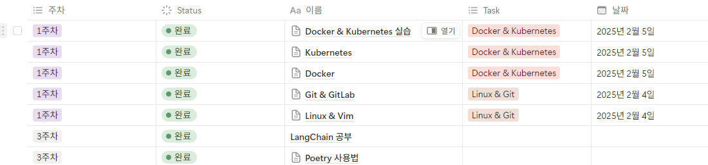

# 다양한 LLM을 이용한 MCP 서버와 LangGraph 연결

## Setup

0. python & uv 설치

[python version](./.python-version) 에 맞는 python 설치

```bash
pip install uv
```

1. 의존성 설치
```bash
uv sync --all-packages
```

2. `.env` 파일 만들기

```.env.sample
OPENAI_API_KEY=sk-proj...
NOTION_API_KEY=ntn_...
# Choose one or both of these depending on your needs:
NOTION_PARENT_PAGE_ID=...  # For creating new databases
NOTION_DATABASE_ID= ... # For working with existing databases
TAVILY_API_KEY=tvly-...
LANGSMITH_API_KEY=lsv2_...
OPEN_WEATHER_API_KEY=...
```

위에 맞는 api-key 를 입력

2. LangGraph Studio 실행
```bash
uv run langgraph dev
```

## tool 구조

- mcp_tools
    - [notion](https://github.com/pbohannon/notion-api-mcp) : notion_api 를 통해 Page 생성, 수정, 데이터베이스 조회 등을 실시한다.
    - rag : [sample.pdf](./mcp_tools/rag/data/sample.pdf) 를 FAISS 에 저장한 뒤, RAG 를 진행하는 Tool
    - web_search : Tavily Search 를 이용하여 인터넷 정보 검색 Tool

- langchain_tools
    - get_weather : [Open Weather](https://openweathermap.org/city/2643743) api 를 이용하여 현재 지역 날씨를 가져오는 tool

## 사용 방법

### RAG
```plaintext
messages : 데이터베이스에서 이커머스 시장 규모가 가장 큰 국가와 그 규모, 이에 비해 가장 작은 규모를 보인 국가와 그 규모를 알려주세요.
```

- 답변 : gpt-4o-mini
```plaintext
1. **가장 큰 규모의 국가**: 
   - **중국**: 이커머스 시장 규모는 약 **2,000조원**으로, 세계 최대의 이커머스 시장입니다. 전체 소매판매 거래액 중 이커머스가 차지하는 비중은 약 **45%**에 달합니다.

2. **가장 작은 규모의 국가**: 
   - **한국**: 이커머스 시장 규모는 약 **159조원**으로, 전체 소매시장 475조원의 약 **33.6%**를 기록하고 있습니다. 

이 정보를 바탕으로 이커머스 시장 규모가 가장 큰 국가는 중국, 가장 작은 국가는 한국임을 알 수 있습니다.
```

- 답변 - Claude Desktop
```plaintext
이커머스 시장 규모 비교
가장 큰 국가: 중국

2020년 기준 온라인 시장 규모는 약 2,000조원
전 세계 온라인 소비의 40.5%가 중국에서 창출됨
전체 소매판매 거래액 중 이커머스 비중은 약 45%로 매우 높음
2위 국가인 미국보다 규모가 2배 이상 큼
알리바바, JD닷컴 등 대형 기업들이 시장 주도 (상위 3사 점유율 92.4%)

가장 작은 국가 (주요 경제국 중): 인도

2020년 기준 이커머스 시장 규모는 약 71조원 (글로벌 7위 추정)
전체 소매판매 중 이커머스 비중은 5.5%에 불과함
낮은 스마트폰 보급률과 열악한 통신 환경이 주요 원인
하지만 세계 2위 인구규모와 젊은 인구 구성으로 인해 향후 성장 잠재력은 매우 큼
아마존과 월마트(플립카트 인수)가 시장 주도

이처럼 이커머스 시장은 국가별로 큰 차이를 보이고 있으며, 중국은 2,000조원으로 가장 큰 시장을 형성하고 있는 반면, 인도는 71조원으로 주요 경제국 중에서는 상대적으로 작은 규모의 시장을 보유하고 있습니다. 이는 약 28배의 차이를 나타냅니다.
```

> claude desktop 이 정답을 보여주고 있음, claude 는 여러번 Query 를 수정하면서 3번의 검색을 통해 결과를 출력함, 본 Agent 는 단순히 1번만 검색하여 한정된 결과에서 정보를 추출한것으로 보임 -> Agent 보완 필요!

### Notion
- notion 에 교육 자료를 정리해둔 데이터베이스에서 검색
- 교육자료 예시


- [notion API 키 발급 및 등록 방법](https://velog.io/@skgmlsla/%EB%85%B8%EC%85%98-API%EB%A1%9C-Database-%ED%99%9C%EC%9A%A9%ED%95%98%EA%B8%B0#postman)
   - Postman 이전까지만 보면 된다.

```plaintext
messages : 노션 데이터베이스에서 1주차는 어떤 목록이 있어?
```

- 답변 : gpt-4o-mini
```plaintext
1주차에 해당하는 목록은 다음과 같습니다:

1. **[Docker & Kubernetes 실습](https://www.notion.so/Docker-Kubernetes-192e44355a0980f099dfc7f87c00456d)**
   - **Task**: Docker & Kubernetes
   - **Status**: Complete
   - **Date**: 2025-02-05

2. **[Kubernetes](https://www.notion.so/Kubernetes-192e44355a098047b4a8dc3fc4fc3cdf)**
   - **Task**: Docker & Kubernetes
   - **Status**: Complete
   - **Date**: 2025-02-05

3. **[Docker](https://www.notion.so/Docker-191e44355a098006894ccea6249ddec2)**
   - **Task**: Docker & Kubernetes
   - **Status**: Complete
   - **Date**: 2025-02-05

4. **[Git & GitLab](https://www.notion.so/Git-GitLab-191e44355a0980239854eeea7f4cab5a)**
   - **Task**: Linux & Git
   - **Status**: Complete
   - **Date**: 2025-02-04

5. **[Linux & Vim](https://www.notion.so/Linux-Vim-191e44355a098006aa0bc2c0bf36fb2d)**
   - **Task**: Linux & Git
   - **Status**: Complete
   - **Date**: 2025-02-04

각 항목을 클릭하면 해당 페이지로 이동할 수 있습니다.
```

### web_search

```plaintext
messages : Qwen3에 대해서 검색하고 한국말로 요약해줘
```

- 답변 - gpt-4o-mini

```plaintext
**Qwen3 요약:**

Qwen3는 최신 대형 언어 모델로, MoE(Mixture of Experts) 아키텍처를 특징으로 하여 AI의 혁신을 이루고 있습니다. 이 모델은 36조 개의 토큰으로 훈련되어 코딩, 수학, 추론 및 다국어 작업에서 뛰어난 성능을 발휘합니다. 

특히 Qwen3-30B-A3B 모델은 MoE의 힘을 보여주며, 이전의 강력한 추론 모델인 QwQ-32B보다 약 1/10의 활성 매개변수를 사용하면서도 성능이 크게 향상되었습니다.

Qwen Chat은 챗봇, 이미지 및 비디오 이해, 이미지 생성, 문서 처리, 웹 검색 통합 및 도구 활용 등 포괄적인 기능을 제공합니다.

자세한 내용은 [Qwen3 공식 웹사이트](https://qwen3.app/)와 [Qwen AI 가이드](https://qwen-ai.com/qwen-3/)에서 확인할 수 있습니다.
```

### get_weather

```plaintext
messages : 현재 서울 날씨를 알려줘
```

- 답변 - gpt-4o-mini

```plaintext
현재 서울의 날씨는 **보통 비**이며, 기온은 약 **14.76도**입니다.
```

# Reference

- [Notion](https://smithery.ai/server/notion-api-mcp)
- [get_weather](https://velog.io/@acdongpgm/Python-%EB%82%A0%EC%94%A8-API-%EC%82%AC%EC%9A%A9%ED%95%98%EA%B8%B0-%EB%AC%B4%EB%A3%8CFree)
